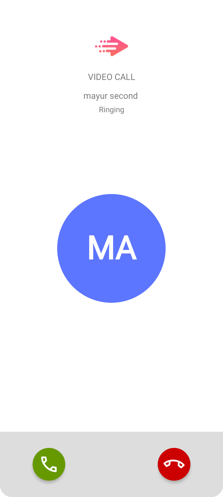
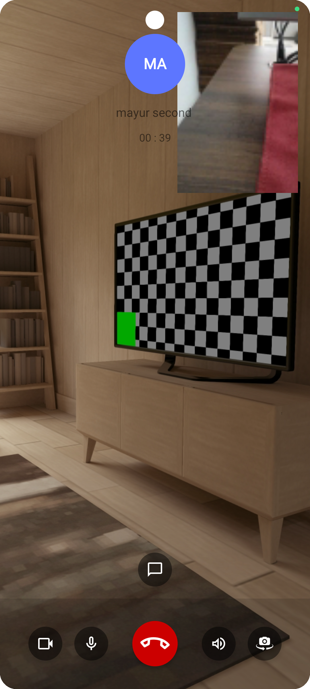

# Isometrik Call Android

A simple call library for Android applications.

<p float="left">
  
  
</p>

## Adding it to your project

To use this library in your Android project, follow the steps below to add the required dependency.

### Step 1: Configure Project Repositories

Ensure your project's build.gradle (Project Level) file contains the following repositories:

```groovy
allprojects {
    repositories {
        mavenCentral()
        maven { url 'https://jitpack.io' }
    }
}
```

### Step 2: Add the Dependency

Open your build.gradle file (app-level) and add the following line in the dependencies section:

```groovy
dependencies {
    implementation 'com.github.isometrikai:isometrik-call-android:1.0.9'
}
```
### Step 3: Sync Your Project

Once you've made the changes, sync your project with the Gradle files by clicking the "Sync Now" button in Android Studio.


# SDK Integration Guide

Follow the steps below to integrate and configure the Isometrik UI SDK in your Android project.

## Step 1: SDK Initialization

Initialize the SDK in your project's `Application` class, specifically within the `onCreate()` method.

```java
IsometrikCallSdk.getInstance().sdkInitialize(this);
```

## Step 2: SDK Configuration

Configure the SDK in the first method called in your app, typically within the `Application` class's `onCreate()` method. You will need the following details for configuration:

- `app_secret`
- `user_secret`
- `license_key`
- `accountId`
- `projectId`
- `keysetId`

Provide these details using the parameters in the method below:

```kotlin

 val conString = accountId + projectId + keysetId
IsometrikCallSdk.getInstance()
                .createConfiguration(
                    getString(R.string.app_secret),
                    getString(R.string.user_secret),
                    conString,
                    licenseKey,
                    BuildConfig.APPLICATION_ID,
                    getString(R.string.app_name)

                )


```
To handle SDK termination, call the following method, usually in the onTerminate() method of the Application class:

```java
IsometrikCallSdk.getInstance().onTerminate();
```

## Step 3: Create a Connection

Establish a connection on the base screen of your app (e.g., `MainActivity` or `LandingActivity`) before accessing the chat functionality. You will need the following details:

- `userClientId` (isometrikUserId + DeviceId)
- `userIsometrikToken`

Use the following method to create a connection:

```java

IsometrikCallSdk.getInstance().getIsometrik().createConnection(userClientId, userIsometrikToken);
```

### Step 4: Start a Call
You are now ready fro audio/video call.

```java

     public void startCall() {

         String memberId = "userID";
         String customType = CallType.AudioCall.getValue();  //  "AudioCall/VideoCall";
         String meetingDescription = "opponentUserName + _ + IsometrikCallSdk.getInstance().getUserSession().getUserName()";
         String opponentName = "opponentName";
         String opponentImageUrl = "opponentImageUrl";


         CreateMeetingQuery createMeetingQuery = new CreateMeetingQuery.Builder()
                 .setHdMeeting(true)
                 .setAudioOnly(customType.equals(CallType.AudioCall.getValue()))
                 .setAutoTerminate(true)
                 .setMeetingDescription(meetingDescription)
                 .setMeetingType(MeetingType.NormalMeeting.getValue())
                 .setUserToken(userToken)
                 .setSelfHosted(true)
                 .setEnableRecording(false)
                 .setDeviceId(IsometrikCallSdk.getInstance().getUserSession().getDeviceId())
                 .setMembers(Collections.singletonList(memberId)).setPushNotifications(true)
                 .setSearchableTags(Collections.singletonList(meetingDescription))
                 .setCustomType(customType).build();

         IsometrikCallSdk.getInstance().getIsometrik().getRemoteUseCases().getMeetingUseCases().createMeeting(createMeetingQuery, (var1, var2) -> {
             if (var1 != null) {
                 Intent intent = new Intent(this, MeetingActivity.class);
                 intent.putExtra("audioOnly", customType.equals(CallType.AudioCall.getValue()));
                 intent.putExtra("hdMeeting", true);
                 intent.putExtra("meetingTitle", opponentName);
                 intent.putExtra("meetingImageUrl", opponentImageUrl);
                 intent.putExtra("meetingId", var1.getMeetingId());
                 intent.putExtra("rtcToken", var1.getRtcToken());
                 intent.putExtra("meetingCreationTime", var1.getCreationTime());
                 intent.putExtra("initiatingCall", true);
                 startActivity(intent);
             }
         });
     }

```

# Technical details

* compileSdkVersion  = 34
* buildToolsVersion = '34.0.0'
* targetSdkVersion 34
* Android gradle plugin 8.4.0
* sourceCompatibility 17
* targetCompatibility 17
* JDK version 17
* Kotlin version 1.9.23


